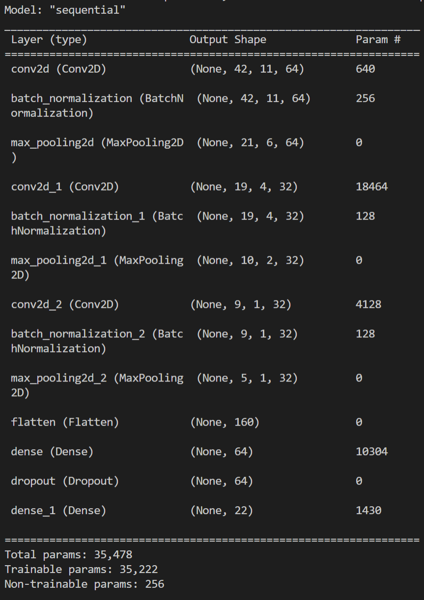
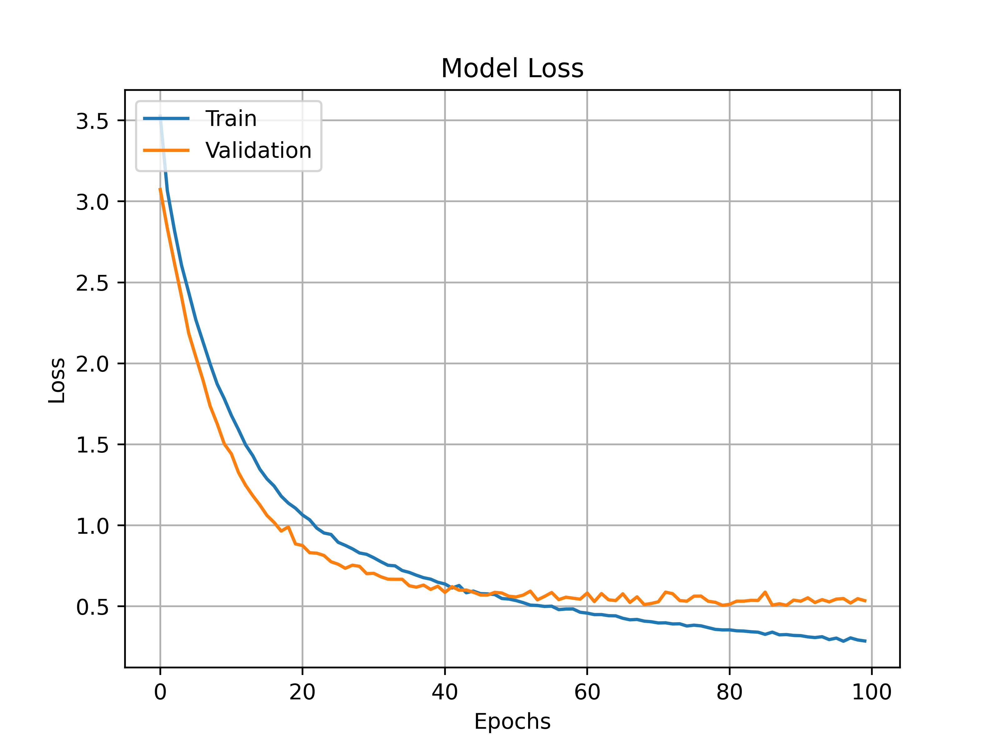

# Urban sound classifier using PyTorch + Torchaudio
---
## **Description**

---
## **Model architecture**

---
## **Model accuracy and loss**

<table>
  <tr>
    <td></td>
    <td></td>
  </tr>
 </table>

---
### **Library Requirements**
    os
    torch
    torchvision

--- 

### **Resources**
- **PyTorch for Audio + Music Processing (V.Velardo):** https://www.youtube.com/playlist?list=PL-wATfeyAMNoirN4idjev6aRu8ISZYVWm